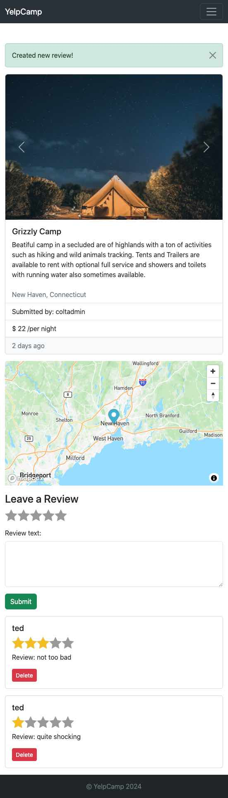

# YelpCamp Website

This is a final project from The Web Development Bootcamt at [Udemy](https://www.udemy.com/course/the-web-developer-bootcamp/) by Colt Steele. The course goes through full stack development process including HTML, CSS, JS, EJS, Node, Express, MongoDB. The app is a version of a rating website where users can post campsites and review them. The functionality includes, register and login users, creating, editing and deleting campgrounds, leaving reviews with star rating and map feature. Additionally 3rd party API services were integrated using images from [Unspash](https://unspash.com) and maps, including cluster map, from [mapbox](https://www.mapbox.com).

[YelpCamp website](https://yelp-camp-hn4d.onrender.com)

### I have learned following throught the course and the project:

- HTML5
- CSS3
- Bootstrap
- JavaScript ES6
- Node
- Express
- Mongo DB
- EJS
- Git and Github
- Best Practices and concepts: OOP, DRY, RESTful, Authentication and Authorisation, Cookies and Sessions, MySQL vs. No SQL, Common Security Issues

### Screenshots

